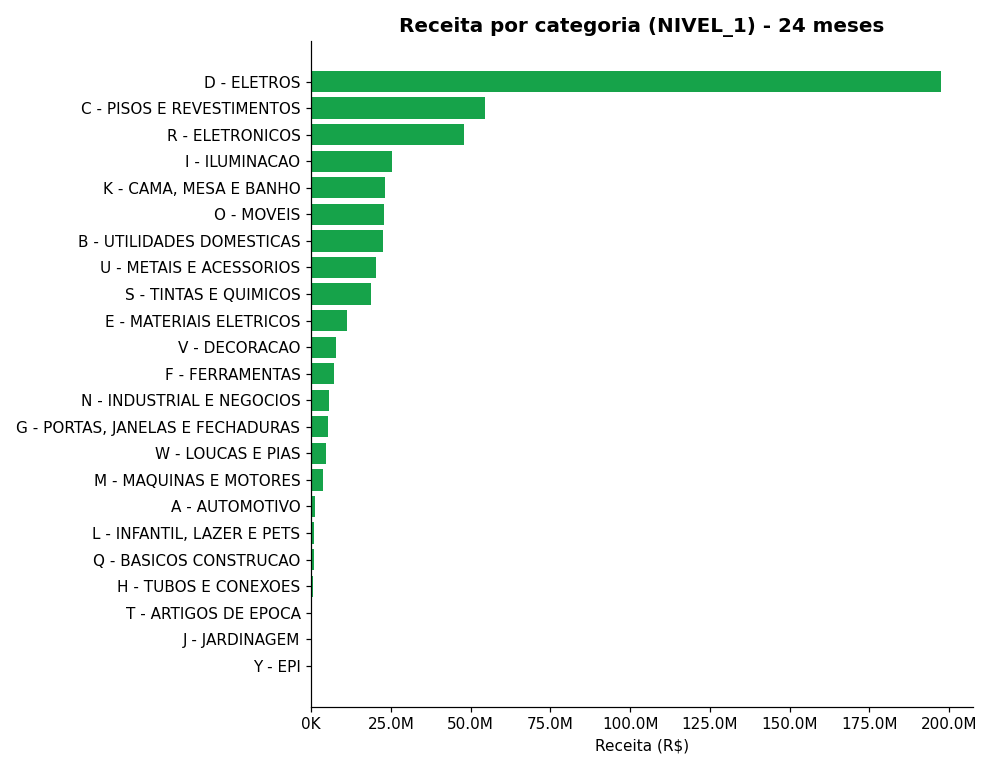
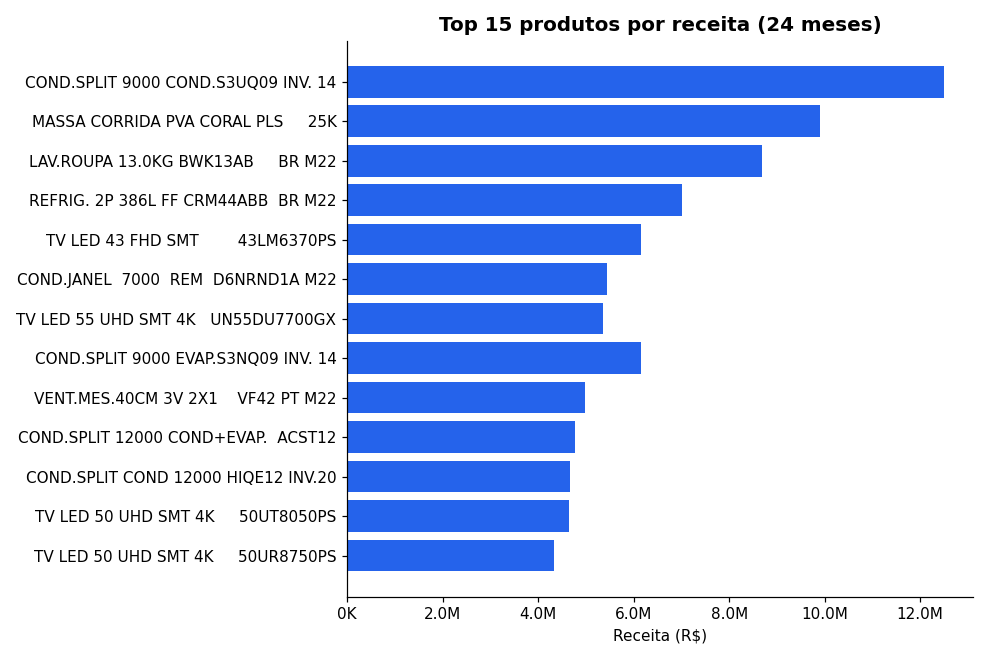
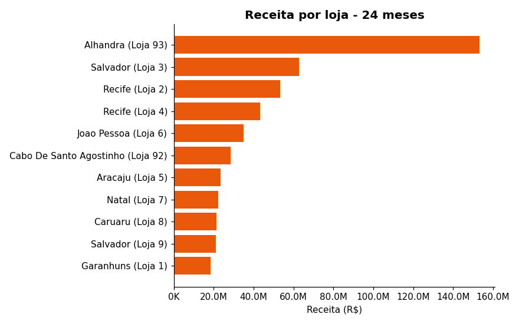
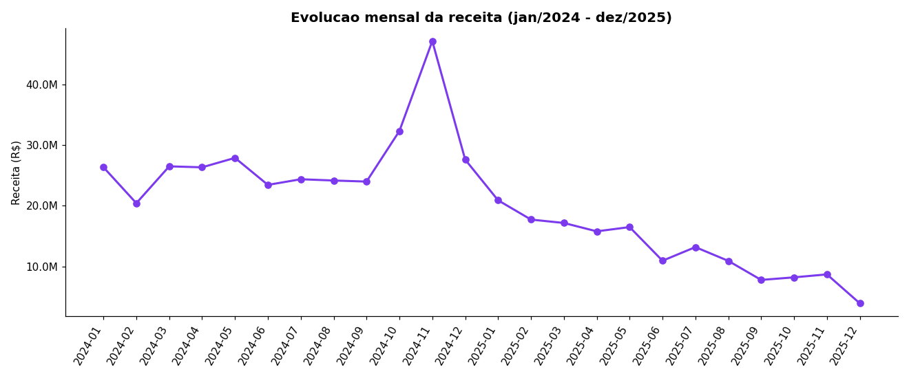
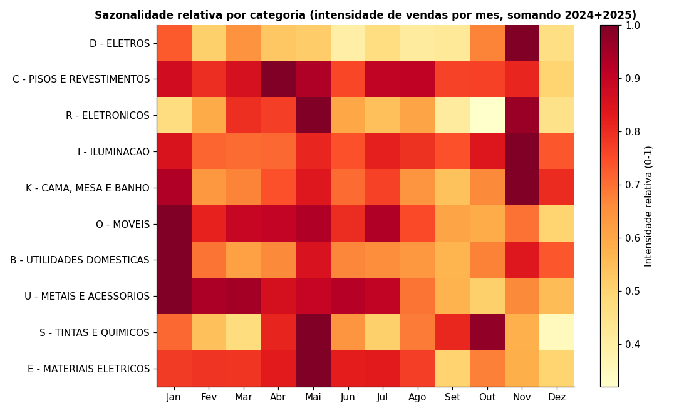
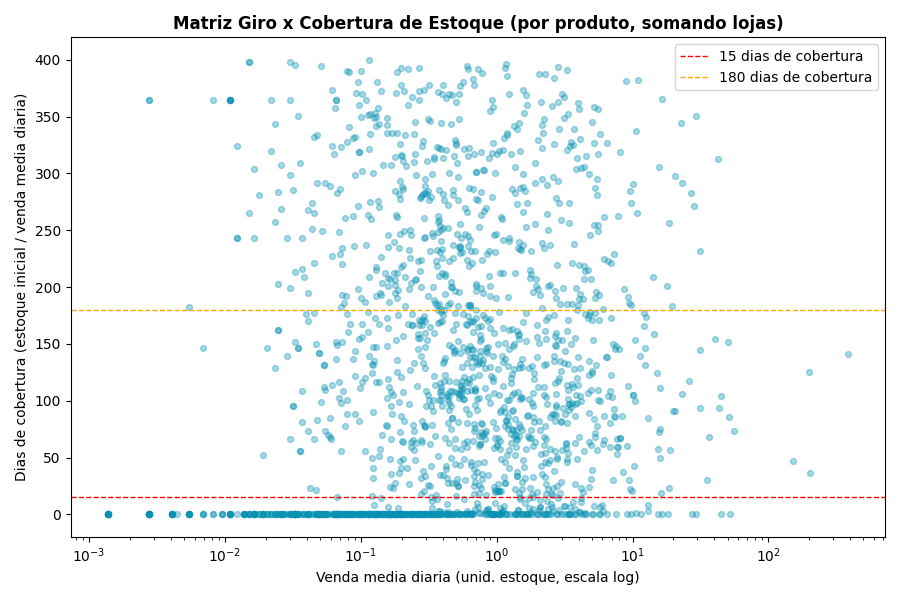
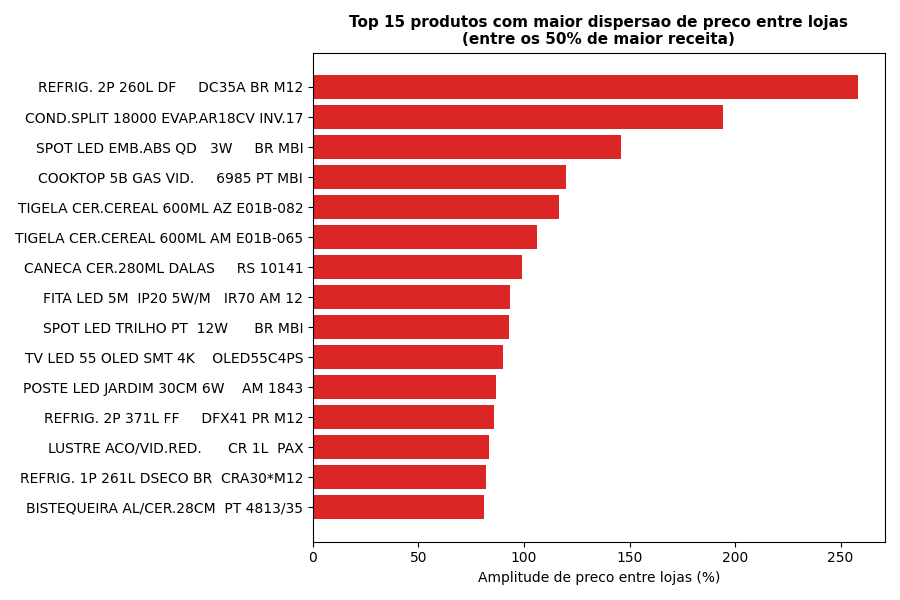
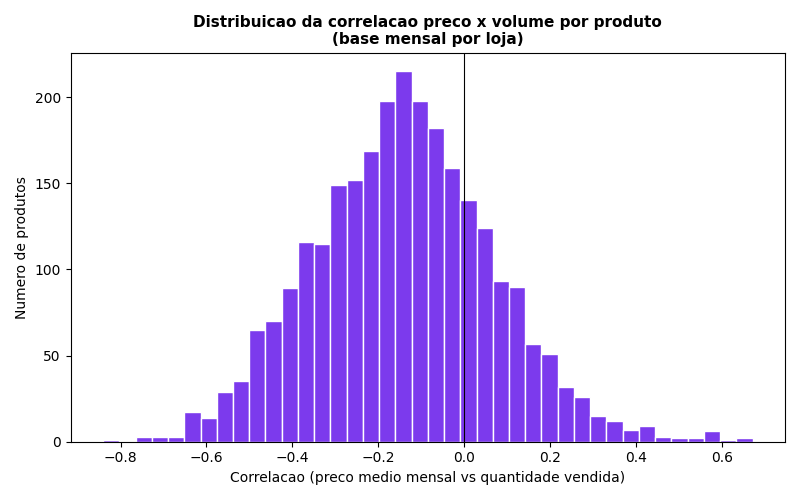
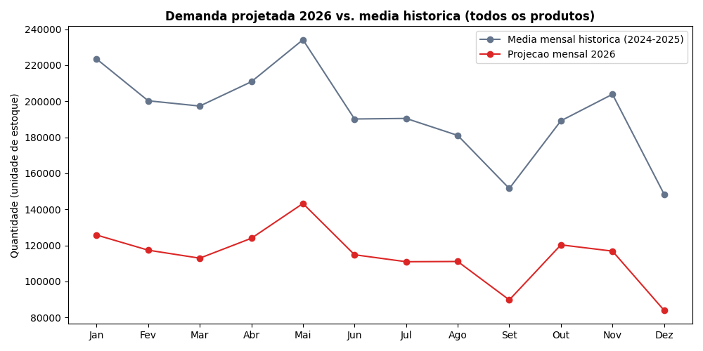

# Análise de Desempenho de Produtos no Varejo
### Rede de materiais de construção, reforma e decoração — 11 lojas, 5 estados do Nordeste

**Período analisado:** jan/2024 – dez/2025 (24 meses) · **Sortimento:** 2.731 SKUs cadastrados · **Base:** 1.090.390 registros de venda, 1.393 registros de compra, 25.330 posições de estoque inicial

---

## Sumário Executivo

Este relatório analisa 24 meses de vendas, compras e estoque de uma rede de 11 lojas no Nordeste, com o objetivo de apoiar decisões de sortimento, precificação e compras para 2026.

**O achado que organiza todo o restante da análise é uma queda estrutural de vendas**: a receita caiu **71,7%** entre o 1º trimestre de 2024 e o 4º trimestre de 2025, atingindo 22 das 23 categorias de produto e 10 das 11 lojas. A Seção 2 investiga cinco hipóteses concorrentes para essa queda e conclui, com evidência dos próprios dados, que ela está mecanicamente associada a uma **contração progressiva da reposição de estoque** (compras): o número de SKUs distintos comprados por mês caiu de 74 (jan/24) para uma média de 14 no segundo semestre de 2025, e o número de SKUs distintos efetivamente vendidos por mês acompanha essa curva com correlação de 0,49. Em outras palavras, **os dados são consistentes com lojas progressivamente ficando sem itens para vender**, não com uma queda espontânea de demanda dos consumidores.

Essa conclusão muda o tipo de recomendação que faz sentido: o problema prioritário não é "quais produtos promover ou descontinuar", mas **entender por que a reposição de estoque minguou** — decisão de compras, restrição de caixa, problema de fornecedor, ou uma limitação da própria base de dados (que, como mostra a Seção 3, já é sabidamente incompleta em `fato_compras`). As demais análises (sortimento parado, precificação, projeção de compras) permanecem válidas e acionáveis, mas devem ser lidas à luz desse diagnóstico.

**Principais números:**

| Indicador | Valor |
|---|---|
| Queda de receita, 1T24 → 4T25 | −71,7% |
| Categorias com queda > 30% no período | 22 de 23 |
| Lojas com queda > 30% no período | 10 de 11 |
| SKUs distintos vendidos/mês, pico (nov/24) → dez/25 | 2.490 → 1.212 (−51%) |
| SKUs distintos comprados/mês, jan/24 → média 2º sem./25 | 74 → 14 |
| Combinações produto×loja com estoque parado | 8.757 |
| Combinações produto×loja com risco de ruptura | 2.931 |
| Produtos candidatos à descontinuação | 224 |
| Produtos candidatos a repricing (padronização + elasticidade) | 210 |
| Demanda projetada 2026 (tendência atual, sem correção) | ~1,37 milhão de unidades (vs. ~2,32 milhões de média histórica) |

---

## 1. Contexto e Metodologia

A rede opera 11 lojas em Pernambuco, Bahia, Sergipe, Paraíba e Rio Grande do Norte, vendendo materiais de construção, reforma, decoração e eletroeletrônicos. Foram fornecidas oito bases: vendas, compras, estoque inicial, dimensão de produtos (com hierarquia de 3 níveis), dimensão de lojas, dimensão de preços por loja/embalagem, dimensão de voltagem e dicionário de unidades de medida.

O pipeline de análise segue sete etapas, cada uma implementada como um script Python independente e reprodutível em `src/` (ver README para instruções de execução):

1. **ETL** — limpeza, padronização de tipos e checagem de integridade referencial;
2. **Estoque projetado** — saldo acumulado (estoque inicial + compras − vendas) por produto/loja/dia;
3. **Desempenho de vendas** — rankings, categorias, lojas, sazonalidade;
3b. **Investigação de causa-raiz** — diagnóstico da queda de vendas (ver Seção 2);
4. **Cobertura de estoque** — giro, produtos parados, risco de ruptura;
5. **Precificação** — dispersão de preço entre lojas, elasticidade aproximada;
6. **Projeção de compras 2026** — tendência + sazonalidade por categoria;
7. **Recomendações** — consolidação em listas acionáveis.

---

## 2. Diagnóstico: por que as vendas caíram 71,7%?

Este é o ponto mais importante do relatório. Uma queda dessa magnitude, sustentada por 24 meses, não pode ser tratada como ruído estatístico ou sazonalidade — precisa de uma explicação testável. Testamos cinco hipóteses concorrentes contra os dados.

### H1 — A queda é causada por fechamento de lojas?
**Rejeitada.** O número de lojas ativas por mês é estável em 10–11 ao longo de todo o período (a 11ª loja entra em operação em março/2024 e permanece ativa até o fim). Não há evidência de fechamento de unidades.

### H2 — A queda está concentrada em poucas categorias de produto?
**Rejeitada.** Comparando o 1º trimestre de 2024 com o 4º trimestre de 2025, **22 das 23 categorias de Nível 1** caem mais de 30%, incluindo as duas maiores (D-Eletros: −74%; C-Pisos e Revestimentos: −73%). A única exceção parcial é F-Ferramentas, com queda de apenas 17%. Isso descarta a hipótese de que um único fornecedor, linha de produto ou categoria específica esteja distorcendo o agregado — o fenômeno é transversal a todo o sortimento.

### H3 — A queda está concentrada em poucas lojas?
**Rejeitada.** **10 das 11 lojas** caem mais de 30% no mesmo comparativo. A única exceção é a Loja 9 (Salvador/BA), que cresce 73% no período — um contraponto interessante que vale investigação à parte (pode ser uma loja que absorveu demanda das demais, ou que teve tratamento diferenciado de reposição). Fora esse caso isolado, a queda é uma característica da rede como um todo, não de uma ou duas unidades com problemas pontuais.

### H4 — O sortimento efetivamente vendido está encolhendo?
**Confirmada.** O número de SKUs distintos vendidos por mês cai de forma quase monotônica após o pico de novembro/2024 (2.490 SKUs) até dezembro/2025 (1.212 SKUs) — uma redução de 51% na largura do sortimento ativo, praticamente na mesma proporção da queda de receita. O número de transações mensais cai na mesma direção (de 71.525 em nov/24 para 12.258 em dez/25). Ou seja: **não é só que cada produto vende menos — é que cada vez menos produtos aparecem numa venda**, o que é a assinatura característica de um problema de disponibilidade de produto, não de demanda do consumidor.

### H5 — A reposição de estoque (compras) está encolhendo, e isso está "matando de fome" o sortimento vendável?
**Confirmada — e é a explicação mais provável.** O número de SKUs distintos comprados por mês cai de 74 em janeiro/2024 para uma média de apenas 14 no segundo semestre de 2025 — uma queda proporcionalmente ainda maior que a do sortimento vendido. A correlação entre "SKUs comprados no mês" e "SKUs vendidos no mês" é de **0,49**, moderada-forte para dados mensais agregados de um processo com defasagem entre compra e venda (produto comprado num mês continua sendo vendido nos meses seguintes até esgotar o estoque, o que dilui e atrasa a correlação — na prática, o efeito real da reposição sobre o sortimento vendável é provavelmente ainda mais forte do que esse número sozinho sugere).

### Conclusão do diagnóstico

A cadeia causal mais consistente com a evidência é:

**Reposição de estoque (compras) encolhe em amplitude → menos SKUs seguem disponíveis em loja → sortimento efetivamente vendido encolhe → transações e receita caem — de forma ampla, atingindo quase todas as categorias e quase todas as lojas simultaneamente.**

Essa cadeia é consistente com a limitação de dados já identificada na Seção 3: `fato_compras` tem apenas 1.393 registros para 2.731 produtos × 11 lojas × 24 meses, um volume claramente insuficiente para sustentar o total vendido no período. Duas explicações não são mutuamente excludentes e **precisam ser verificadas com a área de dados/compras antes de qualquer ação**:

1. **Cenário operacional real**: a empresa de fato reduziu compras ao longo do período (por caixa, decisão estratégica de reduzir sortimento, problema com fornecedores, ou preparação para fechamento/redução de operação), e o efeito em cascata sobre vendas é genuíno.
2. **Cenário de captura de dados**: a base `fato_compras` fornecida não é a base completa de entradas de estoque da empresa (falta capturar transferências entre lojas, devoluções de fornecedor, ajustes de inventário, ou o sistema de origem mudou de captura em algum ponto do período), e a queda de vendas observada é real mas sua causa (reposição) está sendo subestimada nos dados por um problema de extração, não de operação.

**Recomendação de investigação:** antes de finalizar qualquer plano de compras ou sortimento para 2026, validar com a equipe de operações/TI (a) se o volume de compras registrado em `fato_compras` reflete a realidade operacional da rede, e (b) o que aconteceu operacionalmente com o processo de reposição a partir de meados de 2024. Essa resposta muda o peso de todas as recomendações das seções seguintes.

---

## 3. Qualidade e Limpeza dos Dados

- **Encoding:** `dim_produto_1.csv` está em **Latin-1/cp1252**, não UTF-8 (contém caracteres como espaço não separável, 0xA0); as demais bases estão em UTF-8. Ler `dim_produto` como UTF-8 corrompe cerca de metade dos registros — daí o tratamento diferenciado por base no pipeline.
- **Separadores:** bases `dimensao_*` e `fato_estoque_inicial` usam `;` como separador de campo e `,` como separador decimal (padrão Excel BR); `fato_compras` e `fato_vendas` usam `,` como separador de campo e `.` como decimal.
- **Integridade referencial:** 100% das linhas de `fato_vendas`, `fato_compras` e `fato_estoque_inicial` têm produto e loja válidos nas dimensões correspondentes — nenhuma linha órfã foi encontrada (`outputs/tables/checks_integridade.csv`). É um sinal forte de que, apesar da limitação de cobertura de `fato_compras` discutida acima, a qualidade de cadastro em si é boa.
- **Limitação de cobertura de `fato_compras`:** a soma de estoque inicial + compras no período (~1,74 milhão de unidades) é muito menor que o total vendido (~4,64 milhões de unidades) — um gap de 2,7x que só pode ser explicado por reposições de estoque não capturadas nesta base (compras diretas em loja, transferências entre lojas, ajustes de inventário não registrados como "compra"). Por isso:
  - O "estoque projetado" acumulado (estoque inicial + compras − vendas) apresenta saldo negativo em 74% dos eventos de movimentação — isso **não deve ser lido como estoque físico negativo real**, e sim como confirmação de que a base de reposição está incompleta;
  - As análises de cobertura (Seção 5) foram construídas com estoque inicial declarado + venda média diária observada, que são os dados mais confiáveis disponíveis para esse fim;
  - Isso reforça o diagnóstico da Seção 2: se a empresa realmente reabasteceu como mostra `fato_compras`, o desabastecimento explicaria a queda de vendas; se reabasteceu mais do que a base mostra, a queda de vendas tem outra causa a ser investigada separadamente.

---

## 4. Desempenho de Vendas

### Concentração por categoria
A categoria **D – Eletros** domina o faturamento com **41% da receita total** (R$ 197,6 milhões em 24 meses), seguida por **C – Pisos e Revestimentos** (11,3%) e **R – Eletrônicos** (9,9%). Eletros e Eletrônicos somados respondem por **51% da receita com apenas 314 SKUs (11% do sortimento)** — uma concentração de receita alta o suficiente para que qualquer problema de disponibilidade nessas duas categorias (que, aliás, lideram a queda em valor absoluto — Seção 2) tenha efeito desproporcional no resultado da rede.

### Produtos de maior receita
Os 5 produtos de maior receita somam mais de R$ 48 milhões em 24 meses, liderados por dois modelos de ar-condicionado split 9.000 BTUs (R$ 12,5M e R$ 10,0M) e pela massa corrida PVA Coral 25kg — único item fora da linha branca/eletrônicos no top 5, com altíssimo volume (145.797 unidades).

### Lojas e regiões
A loja **93 (Alhandra/PB)** lidera isoladamente em receita (R$ 153,3 milhões) apesar de ter uma das menores quantidades vendidas (97 mil unidades) — evidência de um mix de produtos de altíssimo ticket médio (eletros/eletrônicos), bem diferente do padrão das demais unidades. Consequentemente, o estado da Paraíba concentra 39% da receita da rede com apenas 2 das 11 lojas. Essa mesma loja também é a que mais recua em termos absolutos na queda geral (Seção 2), o que a torna prioritária para investigação operacional.

### Sazonalidade
Novembro é sistematicamente o mês de pico (Black Friday) — em 2024, chegou a R$ 47,2 milhões, quase o dobro da média dos demais meses daquele ano. É importante notar que **mesmo o pico sazonal de novembro/2025 (R$ 8,7M) ficou muito abaixo do pico de novembro/2024** — a sazonalidade continua presente, mas em uma base que já encolheu substancialmente, reforçando que a queda estrutural (Seção 2) atropela o padrão sazonal normal.

---

## 5. Estoque e Cobertura

Metodologia: estoque inicial declarado + venda média diária observada (mais robusta que o saldo acumulado, dada a limitação de `fato_compras` descrita na Seção 3).

- **8.757 combinações produto×loja** (de ~28 mil possíveis) apresentam **estoque parado** — giro inferior a 0,5% do estoque por dia.
- **2.931 combinações produto×loja** apresentam **risco de ruptura** — cobertura projetada abaixo de 15 dias combinada com venda acima da mediana da rede.
- A matriz giro×cobertura evidencia os dois extremos: produtos no canto superior esquerdo (baixo giro, altíssima cobertura) são candidatos naturais a ação de desova/descontinuação; produtos abaixo da linha vermelha (menos de 15 dias de cobertura) com giro alto merecem atenção prioritária de reposição — especialmente à luz do diagnóstico da Seção 2.

---

## 6. Precificação

### Dispersão de preço entre lojas
Entre os produtos de maior receita, encontramos amplitudes de preço entre lojas de **até 258%** para o mesmo item (geladeira 2P 260L, código 455219), com vários outros casos acima de 90–150% (condicionador split 18.000 BTUs, cooktop 5 bocas, spots de LED, TV LED 55" OLED). Amplitudes tão altas em itens de alto giro sugerem falta de padronização de política de preço regional — e não necessariamente diferenças justificáveis de custo logístico entre praças.

### Correlação preço × volume (proxy de elasticidade)
Calculamos a correlação entre preço médio mensal e quantidade vendida por produto (base mensal, por loja). **160 produtos relevantes** (acima da mediana de receita) mostram correlação negativa forte (< −0,4) — nesses casos, os dados sugerem que reduções de preço tendem a vir acompanhadas de aumento de volume, e são os melhores candidatos a teste controlado de repricing. A maioria dos produtos, no entanto, fica com correlação próxima de zero — evidência de que preço não é o principal driver de giro para o sortimento em geral (que parece mais ligado a disponibilidade de estoque, conforme a Seção 2, e a sazonalidade estrutural).

---

## 7. Projeção de Compras para 2026

**Metodologia:** série mensal de vendas por produto → tendência linear por produto (regressão simples sobre os 24 meses) → aplicação de índice de sazonalidade mensal por categoria → adição de 30 dias de estoque de segurança para compor a sugestão de compra líquida.

Como a tendência linear captura a queda estrutural discutida na Seção 2, a demanda total projetada "sem correção" para 2026 (~1,37 milhão de unidades) fica 41% abaixo da média histórica anual (~2,32 milhões). **Essa projeção deve ser tratada como um cenário-piso, não como o plano de compras final**: se a investigação recomendada na Seção 2 confirmar que a queda é causada por sub-reposição (e não por queda real de demanda), a decisão correta pode ser justamente reverter a tendência — aumentando compras para recuperar disponibilidade — em vez de projetá-la para frente. Recomenda-se rodar a projeção em dois cenários (tendência atual vs. reposição normalizada nos níveis de 1T24) e decidir com base na resposta da investigação operacional.

A tabela produto a produto está em `outputs/tables/projecao_compras_2026.csv`, com demanda projetada, estoque de segurança e sugestão de compra líquida por item.

---

## 8. Recomendações Priorizadas

| # | Recomendação | Prioridade | Impacto esperado | Esforço |
|---|---|---|---|---|
| 1 | Investigar com Operações/TI a causa da queda de reposição de estoque (Seção 2) e validar completude de `fato_compras` | **Crítica** | Determina o rumo de todas as demais decisões | Baixo (é uma investigação, não um projeto) |
| 2 | Investigar isoladamente a Loja 9 (Salvador) — única unidade em crescimento — para identificar boas práticas replicáveis | Alta | Potencial de replicar crescimento nas demais 10 lojas | Baixo |
| 3 | Padronizar preços entre lojas nos 50 produtos com maior dispersão (até 258%) | Média-Alta | Redução de atrito de percepção de preço e possível ganho de margem | Médio |
| 4 | Testar reduções de preço controladas (A/B por loja) nos 160 produtos com elasticidade negativa forte | Média | Ganho de volume em itens sensíveis a preço | Médio |
| 5 | Ação de desova/promoção nos itens de maior estoque parado com venda histórica comprovada (1.961 produtos, priorizar os top 20 por volume parado) | Média | Liberação de capital de giro e espaço em loja | Médio |
| 6 | Descontinuar os 224 produtos de receita irrisória e estoque parado (2 com zero venda em 24 meses) | Baixa-Média | Simplificação de sortimento, redução de custo de gestão de cauda longa | Baixo |
| 7 | Recalcular a projeção de compras 2026 em cenário duplo (tendência atual vs. reposição normalizada) após a investigação do item 1 | Alta (mas depende do item 1) | Evita comprar de menos (se a causa for sub-reposição) ou de mais (se a causa for queda real de demanda) | Médio |

### 8.1 Candidatos à promoção (detalhe)
1.961 produtos combinam estoque parado relevante com venda histórica comprovada. Maiores volumes de estoque parado:
- Cerâmica 46x46 PSI67020 (Pisos e Revestimentos) — 46 mil unidades paradas em 8 lojas, R$ 1,5M em receita histórica;
- Kits de talheres linha Savannah (garfo e faca) — mais de 80 mil unidades combinadas paradas em 8 lojas;
- Conjunto de tomada 10A LGX030 POP — 36 mil unidades paradas, mas concentradas em **apenas 1 loja**, o que sugere desbalanceamento de estoque entre lojas mais do que falta de demanda — candidato a transferência interna antes de promoção.

Lista completa: `outputs/tables/rec_candidatos_promocao.csv`.

### 8.2 Candidatos à descontinuação (detalhe)
- **Zero vendas em 24 meses** (2 produtos): ducha higiênica Skin VP e torneira de pia Pare Cr — descontinuação direta;
- **Receita irrisória + estoque parado** (222 produtos): cauda longa como luvas PPR, abraçadeiras plásticas, potes de vidro herméticos e pratos decorativos, com receita acumulada abaixo de ~R$1.100 em 24 meses.

Lista completa: `outputs/tables/rec_candidatos_descontinuacao.csv`.

### 8.3 Repricing (detalhe)
- **Padronização entre lojas** (50 produtos de alto giro, amplitude > 90%): cooktop 5 bocas a gás, condicionador split 18.000 BTUs, TV LED 55" OLED, entre outros;
- **Redução direcionada de preço** (160 produtos, elasticidade < −0,4 e receita relevante): candidatos a teste A/B por loja antes de rollout completo.

Listas completas: `outputs/tables/rec_repricing_padronizacao.csv` e `outputs/tables/rec_repricing_elasticidade.csv`.

---

## 9. Limitações e Próximos Passos

- A base `fato_compras` está incompleta frente ao volume vendido — recomenda-se obter a base completa de reposição (compras + transferências + ajustes) para refazer as análises de ruptura e a projeção de compras com mais precisão.
- A queda de vendas é o achado mais relevante deste estudo e deve ser investigada operacionalmente (Seção 2) antes da adoção das demais recomendações — em especial antes de fechar o plano de compras 2026.
- A projeção de compras usa tendência linear simples por produto; para os itens mais estratégicos (top 20 por receita), recomenda-se um modelo de série temporal mais robusto (ex.: suavização exponencial com sazonalidade explícita) e a análise em cenário duplo descrita na Seção 7.
- A Loja 9 (Salvador), única em crescimento, merece um estudo qualitativo dedicado (visita, entrevista com gerência) para identificar práticas replicáveis.

---

## Reprodutibilidade

Todo o pipeline (ETL → estoque → vendas → causa-raiz → cobertura → preços → projeção → recomendações) está em `src/`, executável em sequência (`01_` a `08_`). Ver `README.md` na raiz do repositório para instruções de execução e a lista completa de tabelas e gráficos gerados.